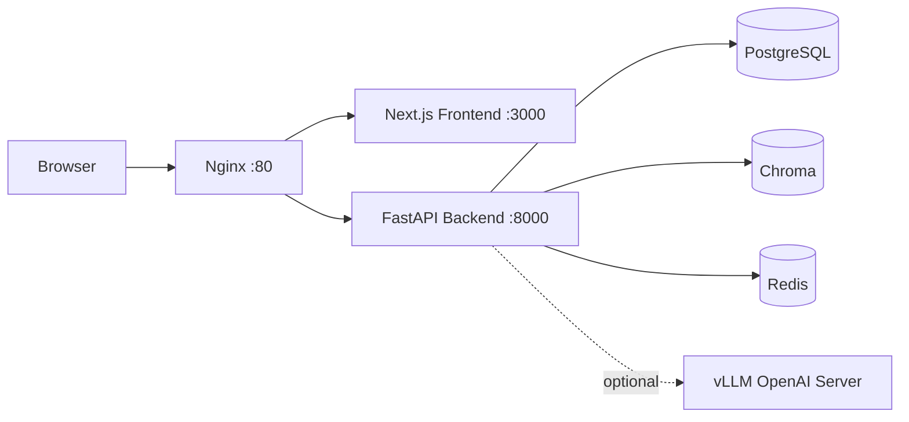

# DevAssist

DevAssist 是一个“可部署、可复现、可扩展”的 AI Developer Assistant：
- 既能做普通聊天，也能做 RAG（检索增强问答）
- 支持 Agent 工具调用（ReAct），并可把工具执行过程落库/展示
- 支持本地 vLLM(OpenAI-compatible) Serving 与 LoRA 适配器加载

This repo is a deployable AI developer assistant with RAG, tool-calling agents, and optional local vLLM serving.

## Quick Start（Docker Compose）

前置要求：
- Docker Desktop（含 `docker compose`）

步骤：
1) 复制环境变量模板

```bash
cp backend/.env.example backend/.env
cp frontend/.env.example frontend/.env
```

2) 启动（Nginx 作为统一入口，只暴露 80 端口）

```bash
docker compose up -d --build
```

3) 验证

```bash
curl http://localhost/health
```

预期输出：

```json
{"status":"ok"}
```

4) 打开页面
- http://localhost

## Architecture（架构）



说明：
- Nginx 负责路径分流：API → backend；页面/静态资源 → frontend
- Redis 用于请求限流（默认 30 req/min per user）
- vLLM 为可选项：用于本地/自建模型推理（OpenAI-compatible API）

## API（后端）

核心接口：
- `GET /health`
- `POST /chat`（支持 `?stream=true` SSE；支持 `model_source=remote|local`）
- `POST /search`
- `POST /ingest`
- `POST /agent`

开发时查看 Swagger：
- http://localhost/docs

## Local vLLM（可选）

如果你想跑本地模型（或 LoRA adapter），参考：
- `docker-compose.gpu.yml`
- `backend/.env.example` 里的 `VLLM_*` 配置

## Dev（本地开发）

后端（FastAPI）：

```bash
cd backend
python3 -m venv .venv
source .venv/bin/activate
python3 -m pip install -r requirements.txt
uvicorn app.main:app --reload --host 0.0.0.0 --port 8000
```

前端（Next.js）：

```bash
cd frontend
npm install
npm run dev
```

此模式下：
- 前端默认跑在 `http://localhost:3000`
- 后端默认跑在 `http://localhost:8000`
- 你可能需要把 `frontend/.env` 的 `NEXT_PUBLIC_API_URL` 改成 `http://localhost:8000`

## Tests

Backend:

```bash
cd backend
python3 -m pytest -q
```
