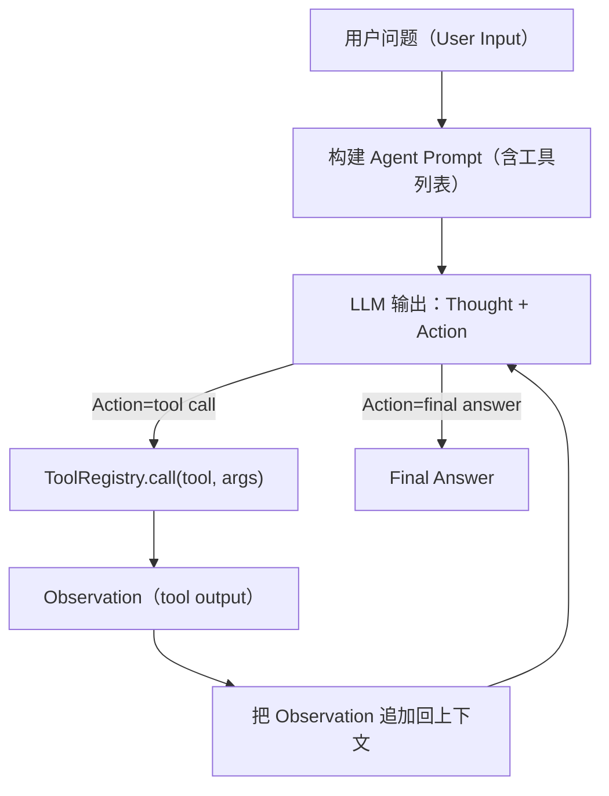

# DevAssist Agent（ReAct）架构设计

一句话：Agent = 在多轮“思考 → 调用工具 → 观察结果”的循环中，把复杂问题拆成可执行步骤，并把每一步的证据（tool observation）纳入下一步推理。

## 目录

- 1. 背景与目标
- 2. 核心概念（ReAct / Tool / Observation）
- 3. 运行时流程（循环、迭代上限、停止条件）
- 4. 工具系统设计（Tool / ToolRegistry / JSON Schema）
- 5. Prompt 约定（输入输出格式、示例）
- 6. 可靠性设计（错误恢复、兜底、超时）
- 7. 安全边界（危险操作、人类确认、隔离执行）
- 8. 可观测性（trace、日志字段、后续落库）
- 9. 与 RAG 的关系（search_docs）

---

## 1. 背景与目标

在 DevAssist 中，Chat 适合回答“直接问答”类问题；但遇到下面的任务，单次生成往往不稳定：

- 需要先检索资料再回答（RAG）
- 需要写代码并验证输出（Sandbox）
- 需要多步骤规划、反复试错与修正（例如调参、数据清洗、生成脚本）

Agent 的目标是把“复杂任务”转成一串可验证的步骤，并在每一步引入外部工具的真实输出作为证据，降低幻觉与误操作概率。

---

## 2. 核心概念（小白版）

- ReAct（Reason + Act）：一种 Agent 运行模式
  - Reason：模型先写出当前打算怎么做（Thought）
  - Act：选择一个工具执行（Action）
  - Observe：把工具输出（Observation）写回上下文，继续下一步
- Tool：可调用的能力单元（例如 `search_docs`、`execute_code`）
- Observation：工具调用的结果，是“事实证据”，下一步推理必须参考它

关键直觉：Agent 不是“更聪明的聊天”，而是“带工具、可迭代、可验真的执行器”。

---

## 3. 运行时流程（循环、迭代上限、停止条件）

Agent 的运行可以用下面的流程表达：



停止条件建议：

- 迭代上限：默认 10 次（防止死循环）
- 明确结束信号：LLM 输出 `final` 类型答案（而不是 tool call）
- 不可恢复错误：连续重试失败后走兜底策略，返回可解释错误

---

## 4. 工具系统设计（Tool / ToolRegistry / JSON Schema）

代码位置：

- `Tool` 与 `ToolRegistry`：`backend/app/agent/tools.py`
- 内置工具定义：`backend/app/agent/builtin_tools.py`

### 4.1 Tool 结构

Tool 的核心字段：

- `name`：工具名（唯一）
- `description`：给 LLM 看的用途说明
- `parameters`：JSON Schema（描述入参结构）
- `return_schema`：JSON Schema（描述返回结构）
- `handler`：执行函数（支持 async）

为什么需要 JSON Schema：

- 让 LLM “知道该怎么传参”
- 让系统在执行前做校验（避免无意义/危险调用）
- 未来可以无缝对接 OpenAI-style tool calling（functions/tools）

### 4.2 ToolRegistry 能力

ToolRegistry 的职责：

- 注册工具（避免重复）
- 获取工具（name → Tool）
- 执行工具（校验入参后调用 handler）
- 导出工具定义（供 LLM 使用）

---

## 5. Prompt 约定（输入输出格式、示例）

为了让 LLM 稳定地产生“可解析”的 action，我们需要规定输出格式。推荐约定如下（纯文本也可解析）：

- `Thought:` 描述当前推理（可选输出给用户，通常用于 trace）
- `Action:` 指定要做什么
  - `tool:<name>` + `args:<json>`
  - 或 `final:<answer>`

示例（检索）：

```
Thought: 我需要先查 FastAPI 关于依赖注入的官方说明，再总结关键点。
Action: tool:search_docs
args: {"query":"FastAPI dependency injection", "top_k": 5, "collection_name": "fastapi_docs"}
```

示例（执行代码）：

```
Thought: 我先写一段最小可运行样例来验证输出。
Action: tool:execute_code
args: {"code":"print(1+1)", "timeout_s": 3}
```

示例（结束）：

```
Thought: 已获得检索证据与运行结果，可以给出最终结论。
Action: final: 这里是最终答案……
```

---

## 6. 可靠性设计（错误恢复、兜底、超时）

建议的工程策略：

- 工具入参校验失败：直接返回 4xx（不要调用 handler）
- 工具执行失败：
  - 对可重试错误进行有限次重试（例如最多 3 次）
  - 失败后返回结构化错误，让 LLM 有机会自我修正参数或改用其它工具
- 沙箱超时：返回 `sandbox_timeout`，并保证容器被 kill/remove（避免资源泄露）

在 Day39/Day40 的实现中，沙箱超时会触发 kill + remove，且有单测覆盖。

---

## 7. 安全边界（危险操作、人类确认、隔离执行）

工程上必须承认：工具调用意味着“可执行能力”，需要边界。

建议策略（后续阶段实现）：

- 文件写入：限制目录 allowlist（例如只允许写 /data 或项目指定目录）
- 网络请求：默认禁用或需要确认（尤其是外部 URL）
- 系统命令：默认禁止（或只开放受控命令集合）
- 代码执行：强制走 Docker sandbox，且默认 network disabled

---

## 8. 可观测性（trace、日志字段、后续落库）

为什么要 trace：

- 复盘 Agent 的每一步决策（Thought/Action/Observation）
- 排查工具失败原因
- 为后续评测与改进提供数据

建议的 trace 结构（后续会实现到 DB）：

- step_index
- thought
- action（tool name / args）
- observation（tool output 摘要 + 原始 JSON）
- latency / token usage（LLM call）
- error（如果有）

---

## 9. 与 RAG 的关系（search_docs）

`search_docs` 是 Agent 能力的第一块拼图：

- 让 Agent 能主动检索知识库，而不是凭空回答
- 返回结构化 chunk（含 source/chunk_index/content/snippet），方便后续生成引用或进一步推理

后续典型链路：

1) `search_docs` 拿到证据
2) LLM 基于证据生成答案（并带 citations）
3) 如果需要验证，再调用 `execute_code`

